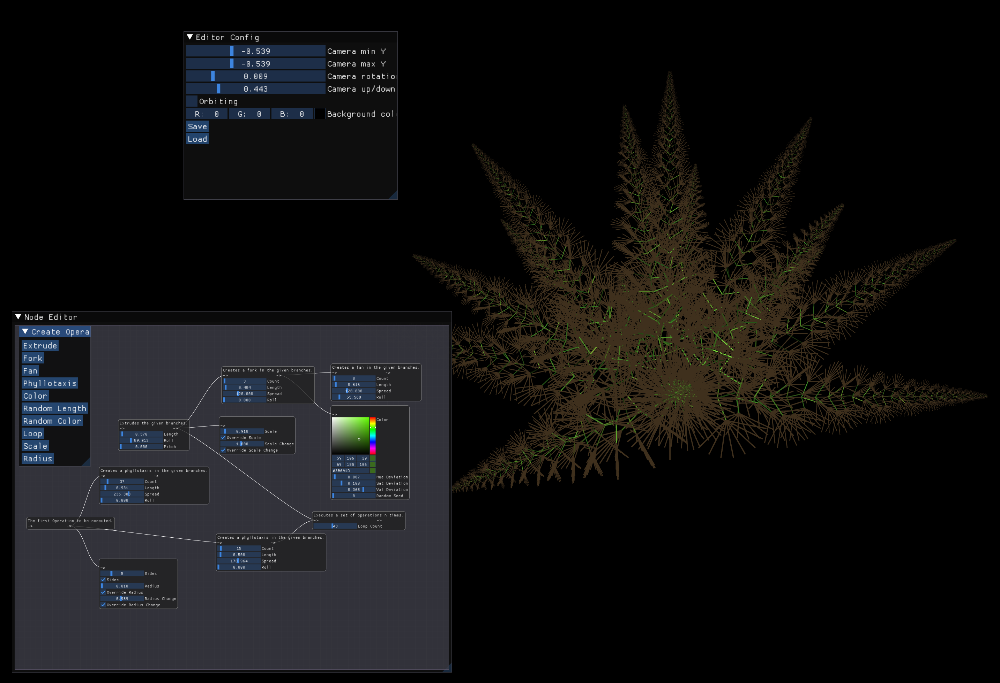
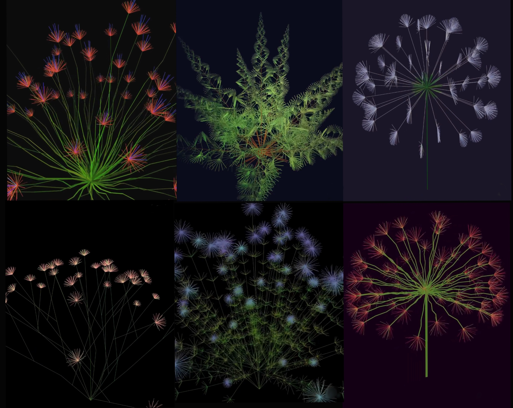

# Node based Plant Generation
Tool for the procedural generation of plants. Complex and beautiful plants can be created by chaining together nodes that perform simple instructions. This design is very well suited to the recursive nature of plants. Plants can also be saved to and loaded from .plant files.

## Building
